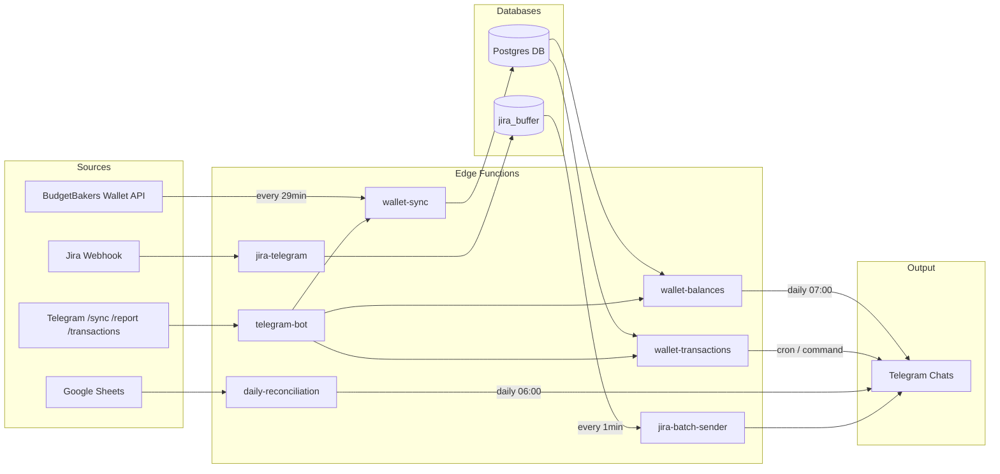

# walletbot

Home finance automation — syncs transaction data from **BudgetBakers Wallet** (a personal finance app that connects to bank accounts via PSD2/Open Banking) into Supabase, tracks planned spending in Google Sheets, and delivers daily reports, transaction digests, and reconciliation summaries to Telegram. Also bridges Jira issue updates to Telegram for team notifications.

### What is Wallet?

[Wallet by BudgetBakers](https://budgetbakers.com) is a personal finance manager that links to bank accounts, auto-categorizes transactions, and tracks budgets against spending. It exposes a REST API for accounts, categories, labels, budgets, goals, and records — this project syncs all of that into a local Supabase DB for custom analytics, reporting, and reconciliation against a manual planned-expenses sheet.

### What it does

- **Syncs** all Wallet data (accounts, categories, labels, budgets, goals, 2400+ records) into Supabase every 29 minutes
- **Reports** account balances, monthly cashflow, and pending cross-account transfers to Telegram daily at 07:00
- **Sends** new transactions as they appear (cron mode, deduplicated)
- **Reconciles** Google Sheets planned expenses against actual DB transactions every morning at 08:00 CEST — flags discrepancies, missing items, and envelope budget violations
- **Notifies** Jira issue changes (creation, updates, comments, worklogs) to a Telegram chat within seconds

## Architecture



**Legend:** ▢ = Edge Function | 💾 = Database | ➡️ = triggers/calls | Label on arrow = trigger type

## Edge Functions

| Function | Trigger | Purpose | Auth |
|---|---|---|---|
| `wallet-sync` | Cron `*/29 * * * *` | Sync accounts, categories, labels, budgets, records from BudgetBakers API | Service role key |
| `wallet-balances` | Cron `0 7 * * *` / Telegram `/report` | Account balances, cashflow, pending transfers | Service role key |
| `wallet-transactions` | Cron / Telegram `/transactions N` | Show transactions for a given date | Service role key |
| `daily-reconciliation` | Cron `0 6 * * *` | Compare Google Sheets planned expenses vs DB actuals | Service role key |
| `telegram-bot` | Telegram webhook | Route `/sync`, `/report`, `/transactions` commands | Webhook secret |
| `jira-telegram` | Jira webhook | Receive Jira webhooks, buffer into `jira_buffer` | HMAC-SHA256 |
| `jira-batch-sender` | Cron `* * * * *` (via `check_buffer_and_poke()`) | Batch-send buffered Jira updates to Telegram | Service role key |

## Database

18 tables: `wallet_accounts`, `wallet_records`, `wallet_categories`, `wallet_labels`, `wallet_budgets`, `wallet_goals`, `wallet_sync_state`, `wallet_budget_category_map`, `wallet_shown_transactions`, `app_config`, `jira_buffer`, `telegram_bot_state`, `category_tree`, `category_envelope_parent_mapping`, `envelope_groups`, `files`, `parsed_receipts`, `prompts`.

4 functions: `get_wallet_balances()`, `get_wallet_budgets()`, `get_parent_group()`, `check_buffer_and_poke()`.

See `supabase/migrations/001_schema.sql`.

## Deploy

```bash
# Prerequisites: supabase CLI, Deno
./deploy.sh <project-ref>

# Or via Makefile
make deploy PROJECT_REF=<project-ref>
```

Each function needs its env vars set in the Supabase dashboard. See `.env.example` files.

## Development

```bash
# Format all code
make fmt        # deno fmt .

# Check formatting
make check      # deno fmt --check .

# Install supabase CLI for local development
# supabase init && supabase start
```

## Secrets

Secrets stored in `app_config` DB table (not env vars):
- `GCP_SERVICE_ACCOUNT_KEY` — JSON key for Google Sheets access
- `SHEET_ID` — Google Sheet ID for reconciliation
